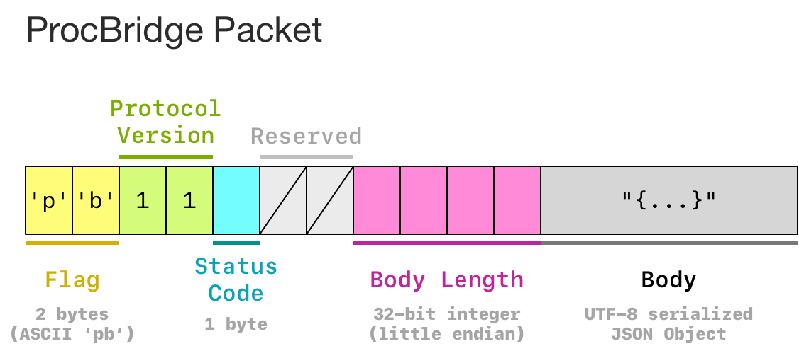

# 1. Introduction

ProcBridge is a super-lightweight IPC (Inter-Process Communication) protocol over TCP socket. It enables you to **send and recieve JSON** between processes easily. ProcBridge is much like a simplified version of HTTP protocol, but only transfer JSON values.

On the server side, you **define a function which handles requests and returns result**. On the client side, you just **make request and get results synchronously**. Both requests and responses are wildcard JSON values (null, boolean, number, string, object, and array).

ProcBridge has been **implemented in Java, Python, and Node.js**. If you want to connect two processes and HTTP & RPC are too heavy for your scenario, then ProcBridge will be an ideal choice.

# 2. Instructions & Example

Please go to sub-repos for more information.

- ✅ **Java** - [gongzhang/procbridge-java](https://github.com/gongzhang/procbridge-java)
- ✅ **Python** - [gongzhang/procbridge-python](https://github.com/gongzhang/procbridge-python)
- ✅ **Node.js** - [gongzhang/procbridge-nodejs](https://github.com/gongzhang/procbridge-nodejs)
- ⚠️ **Go** - not yet supported

# 3. Protocol Design

Both request and response are encoded into **ProcBridge Packets**. Those binary packets are sent over TCP socket directly. Talk is cheap, please read [Python implementation](https://github.com/gongzhang/procbridge-python/blob/master/procbridge/protocol.py) to fully understand the protocol design.

# 4. Collaboration

👀 **Note for Early Collaborators (2019-01-10)**
 
The library implementations have been **refactored** and **migrated** to sub-repos as described above. From now on, this repo only stores docs. If you worked on `master` branch before, please switch to `legacy` branch. Thank you for your understanding and support. 😼

***

Below is the collaboration guideline:

#### ✨ Extend the protocol

If you want to extend the protocol, for example:

- support packet compression
- support bidirectional communication
- support long connection and event-based communication
- define conventions to method name or JSON body

Please open an issue first.

#### ✨ Implement the protocol

You can quickly implement ProcBridge in any other programming languages. Note that it **only takes 300 lines of code** to fully implement the protocol in Python. Please name your repo like `procbridge-xxx` where `xxx` is your programming language. Don't forget to open an issue to let me know it.

#### ✨ Improve existing implementation

Cool. Please open PR in sub-repos.

# 5. Contacts

👨🏻‍💻 Gong Zhang (gong@me.com)
