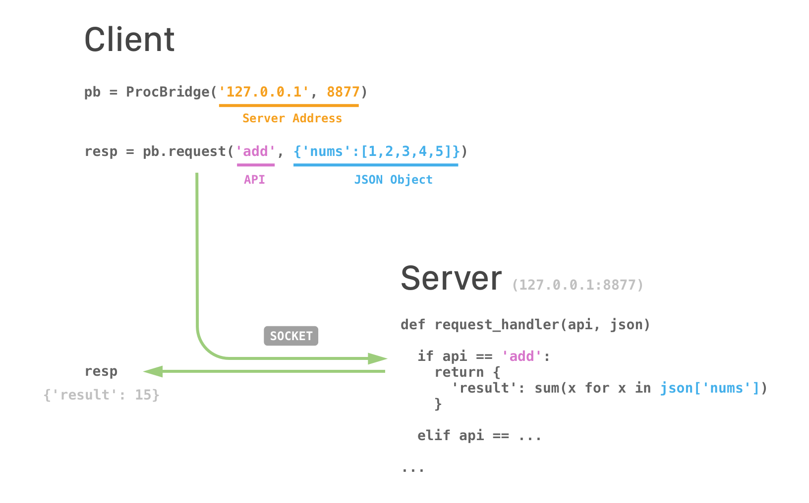
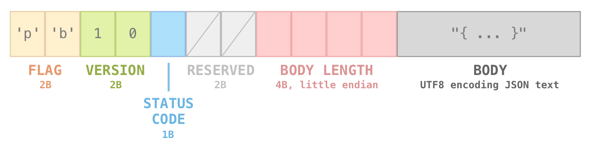

# 1. Introduction

**ProcBridge** is a lightweight **socket-based** IPC (*Inter-Process Communication*) protocol. The goal is to provide an **consistency** and **convenient** way for developers to implement inter-process applications. Currently we have **Java** and **Python** implementations. More languages will be supported in the future.

#### Communication Model

ProcBridge is based on **Request-Response** model. Server provides a group of APIs and clients send requests to them. All the communications use arbitrary **JSON** objects to carry higher-level data. The following diagram uses pseudocode to give you a general idea about how ProcBridge works.



The *next version* of ProcBridge will also support **Event-Based** model, which unifies the communication code between server side and client side.

#### Versions

- 1.0 (latest release)

#### Compatibility Notes

- **Java**: 8+
- **Python**: 3.5+

If you need to use ProcBridge on an earlier version runtime, feel free to open an issue or folk my repo.

# 2. Download

## 2.1 Java

#### Maven

```xml
<dependency>
    <groupId>co.gongzh.procbridge</groupId>
    <artifactId>procbridge</artifactId>
    <version>1.0</version>
</dependency>
```

#### Gradle

```gradle
compile 'co.gongzh.procbridge:procbridge:1.0'
```

#### Jar

> You can download jars on [releases](https://github.com/gongzhang/proc-bridge/releases) page.

#### Source Code

> The `Java/ProcBrdige` directory is a *IntelliJ IDEA* project. You can import it in latest version of *IntelliJ IDEA* IDE and compile it using **JDK 8** or higher version.

## 2.2 Python

#### PyPI (pip)

```
pip install procbridge
```

#### Source Code

> The `Python/ProcBrdige` directory is a *PyCharm* project. You can import it in latest version of *PyCharm Community* IDE and compile it using **Python 3.5** or higher version.

# 3. Examples

With ProcBridge, clients can send high-level requests to server. Each request has two parts: an **API name** and an optional **JSON body**. The **API name** is any non-empty string that defined on server-side. The **JSON body** can by any valid JSON. The server will handle the request and send response back to clients, which is also an arbitrary JSON object.

In the following examples, the server defines two APIs. One is `echo`, which directly send back the JSON object sent from client. The other is `add`, which sums up a group of integers and send the result back to client.

## 3.1 Python Example

- Server
```python
host = '127.0.0.1'
port = 8077

def request_handler(api: str, arg: dict) -> dict:
    if api == 'echo':
        return arg
    elif api == 'add':
        return {'result': sum(x for x in arg['elements'])}
    else:
        raise Exception('unknown api')

server = ProcBridgeServer(host, port, request_handler)
server.start()
```

- Client
```python
host = '127.0.0.1'
port = 8077

client = ProcBridge(host, port)

print(client.request('echo', {}))  # prints "{}"

print(client.request('add', {      # prints "{result: 15}"
    'elements': [1, 2, 3, 4, 5]
}))
```

## 3.2 Java Example

- Server
```java
int port = 8877;
long timeout = 10000; // 10 seconds

ProcBridgeServer server = new ProcBridgeServer(port, timeout, new Object() {

    @APIHandler JSONObject echo(JSONObject arg) {
        return arg;
    }

    @APIHandler JSONObject add(JSONObject arg) {
        JSONArray elements = arg.getJSONArray("elements");
        int sum = 0;
        for (int i = 0; i < elements.length(); i++) {
            sum += elements.getInt(i);
        }
        JSONObject result = new JSONObject();
        result.put("result", sum);
        return result;
    }

});

server.start();
```

- Client
```java
String host = "127.0.0.1";
int port = 8877;
long timeout = 10000; // 10 seconds

ProcBridge pb = new ProcBridge(host, port, timeout);
JSONObject resp;

resp = pb.request("echo", "{}");
System.out.println(resp); // prints "{}"

resp = pb.request("add", "{elements: [1, 2, 3, 4, 5]}");
System.out.println(resp); // prints "{result: 15}"
```

# 4. Development Plan

> Add later.

# 5. Protocol Design



- **FLAG** (2 bytes): two fixed ASCII charactors `'p'` and `'b'` in lowercase
- **VERSION** (2 bytes): `0x1` and `0x0` indicate the major/minor version of the protocol
- **STATUS CODE** (1 bytes): a flag that indicates the body is a request or response
- **RESERVED BYTES** (2 bytes)
- **BODY LENGTH** (4 bytes): an unsigned little-endian integer
- **BODY**: an UTF-8 encoded JSON text, always an JSON object `{ ... }`.


# 6. Contacts

Feel free to open issues or contact me:

- Gong Zhang (gong@me.com)
